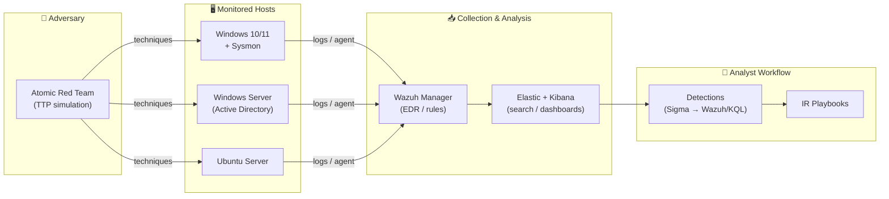

# 🛡️ Sean Spakausky — Cybersecurity Portfolio

### Blue Team · SOC Analyst · Detection Engineering · Incident Response

*Recent cybersecurity graduate focused on defensive operations — building detections, hunting threats, and hardening systems against real-world adversary behavior.*

---

## 👋 About Me

I'm an entry-level security analyst who learns by **building and breaking in a lab, then defending it**. Rather than collecting tutorials, I run a home SOC where I simulate adversary techniques (Atomic Red Team) and then write the detections, playbooks, and hardening that would have caught or stopped them.

This repo is a living record of that work — every project here is something I actually built, tested, and documented. My goal is to show *how I think* as a defender, not just what tools I've touched.

> **What I bring to a SOC:** a detection-first mindset, comfort living in logs, MITRE ATT&CK fluency, and the documentation discipline to make incidents repeatable and reviewable.

---

## 🎯 Areas of Focus

| Area | What I do |
|------|-----------|
| 🔍 **Detection Engineering** | Write & tune Sigma / Wazuh / KQL rules mapped to MITRE ATT&CK, reduce false positives, validate with attack simulation |
| 🚨 **Incident Response** | NIST 800-61 aligned playbooks for phishing, ransomware, and account compromise |
| 🐺 **Threat Hunting** | Hypothesis-driven hunts across Windows/Sysmon and network telemetry |
| 🔒 **System Hardening** | CIS Benchmark baselines for Windows & Linux, with auditable scripts |
| 📊 **SIEM & Log Analysis** | Wazuh, Elastic/ELK, Splunk SPL, parsing and enriching noisy log sources |

---

## 🧰 Skills & Tooling

**SIEM / EDR / Monitoring**
`Wazuh` · `Elastic (ELK)` · `Splunk` · `Security Onion` · `Sysmon` · `Suricata`

**Detection & Hunting**
`MITRE ATT&CK` · `Sigma` · `KQL` · `Splunk SPL` · `Atomic Red Team` · `YARA`

**Platforms & Hardening**
`Windows / Active Directory` · `Linux` · `CIS Benchmarks` · `Group Policy`

**Scripting & Automation**
`Python` · `PowerShell` · `Bash` · `Regex`

**Frameworks & Standards**
`MITRE ATT&CK` · `NIST CSF` · `NIST 800-61` · `Cyber Kill Chain` · `Pyramid of Pain`

---

## 📂 Featured Projects

Each project is self-contained with its own README, objectives, and lessons learned.

| # | Project | What it demonstrates |
|---|---------|----------------------|
| 01 | [🏠 Home SOC Lab](./projects/01-home-soc-lab/) | End-to-end detection lab: Wazuh + ELK + Sysmon, attack simulation, telemetry pipeline |
| 02 | [📡 SIEM Detection Rules](./projects/02-siem-detection-rules/) | Custom Sigma & Wazuh detections mapped to ATT&CK, with tuning notes |
| 03 | [🚨 Incident Response Playbooks](./projects/03-incident-response-playbooks/) | NIST 800-61 playbooks for phishing, ransomware & compromised accounts |
| 04 | [🐺 Threat Hunting & Log Analysis](./projects/04-threat-hunting-log-analysis/) | Hypothesis-driven hunt writeups with KQL/SPL queries and findings |
| 05 | [🔒 System Hardening](./projects/05-system-hardening/) | CIS-aligned Windows & Linux hardening scripts with audit output |

---

## 🏠 Home SOC Lab

The backbone of this portfolio — a virtualized environment where I generate real telemetry, simulate attacks, and validate every detection I write.

➡️ **Full build, configuration, and lessons learned:** [projects/01-home-soc-lab](./projects/01-home-soc-lab/)

---

## 🎓 Education & Certifications

| | |
|---|---|
| 🎓 **B.S. Cybersecurity** | *(2026 graduate)* — see [docs/education.md](./docs/education.md) |
| 📜 **Certifications** | CompTIA Security+ · *(in progress: Blue Team Level 1 / BTL1)* — [docs/certifications.md](./docs/certifications.md) |

> 📌 *Certifications and education details are placeholders — update [docs/certifications.md](./docs/certifications.md) and [docs/education.md](./docs/education.md) with your specifics.*

---

## 🌱 Currently Learning

- Detection-as-code workflows (Sigma → CI/CD validation)
- Deeper KQL for Microsoft Sentinel / Defender
- Threat intelligence enrichment (MISP, OpenCTI)
- Cloud detection fundamentals (AWS CloudTrail, GuardDuty)

---

## 🤝 Let's Connect

I'm actively looking for **entry-level SOC Analyst / Security Analyst** roles.

- 📧 **Email:** *your.email@example.com*
- 💼 **LinkedIn:** *linkedin.com/in/your-handle*
- 📝 **Blog / Writeups:** *optional*

> 📌 *Replace the contact placeholders above with your real details before sharing this with recruiters.*

---

*Built and documented by Sean Spakausky · This portfolio is continuously updated as I complete new lab work.*

