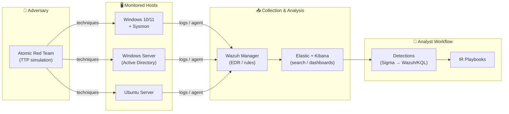

# Sean Spakausky — Cybersecurity Portfolio

### Blue Team · SOC Analyst · Detection Engineering · Incident Response

*Recent cybersecurity graduate focused on defensive operations — building detections, hunting threats, and hardening systems against real-world adversary behavior.*

---

## 👋 About Me

I'm an entry-level security analyst who learns by **building and breaking in a lab, then defending it**. Rather than collecting tutorials, I run both a virtualized SOC environment (attack simulation → detection → playbook) and a physical home monitoring lab (sensors, MQTT, NVR, DNS security) where I generate real telemetry and operate real infrastructure.

This repo is a living record of that work — every project here is something I actually built, tested, and documented. Offensive projects are framed with full defensive analysis: what does this look like in a SIEM? What Sigma rule catches it? What hardening eliminates the attack surface?

> **What I bring to a SOC:** a detection-first mindset, comfort living in logs, MITRE ATT&CK fluency, hands-on network operations experience, and the documentation discipline to make incidents repeatable and reviewable.

---

## 🎯 Areas of Focus

| Area | What I do |
|------|-----------|
| 🔍 **Detection Engineering** | Write & tune Sigma / Wazuh / KQL rules mapped to MITRE ATT&CK, reduce false positives, validate with attack simulation |
| 🚨 **Incident Response** | NIST 800-61 aligned playbooks for phishing, ransomware, and account compromise |
| 🐺 **Threat Hunting** | Hypothesis-driven hunts across Windows/Sysmon and network telemetry |
| 🔒 **System Hardening** | CIS Benchmark baselines for Windows & Linux, with auditable scripts |
| 📊 **SIEM & Log Analysis** | Wazuh, Elastic/ELK, Splunk SPL, Suricata, Zeek — parsing and enriching noisy log sources |
| 🌐 **Network IDS** | Suricata rule writing, Zeek structured log analysis, pcap-based validation |
| 🔴 **Red Team Research** | Offensive technique study (AMSI bypass, privesc, wireless attacks) to build better blue team detections |

---

## 🧰 Skills & Tooling

**SIEM / EDR / Monitoring**
`Wazuh` · `Elastic (ELK)` · `Splunk` · `Security Onion` · `Sysmon` · `Suricata` · `Zeek`

**Detection & Hunting**
`MITRE ATT&CK` · `Sigma` · `KQL` · `Splunk SPL` · `Atomic Red Team` · `YARA`

**Network & Wireless**
`Wireshark` · `Kismet` · `aircrack-ng` · `Scapy` · `tcpdump` · `802.11 protocol`

**Platforms & Hardening**
`Windows / Active Directory` · `Linux` · `CIS Benchmarks` · `Group Policy`

**Scripting & Automation**
`Python` · `C#` · `PowerShell` · `Bash` · `Regex`

**IoT / Home Lab**
`Home Assistant OS` · `ESPHome` · `MQTT` · `Frigate NVR` · `AdGuard Home`

**Frameworks & Standards**
`MITRE ATT&CK` · `NIST CSF` · `NIST 800-61` · `Cyber Kill Chain` · `Pyramid of Pain`

---

## 📂 Projects

Each project is self-contained with its own README, objectives, and lessons learned.

### 🔵 Blue Team / Defensive

| # | Project | What it demonstrates |
|---|---------|----------------------|
| 01 | [🏠 Home SOC Lab](./projects/01-home-soc-lab/) | End-to-end detection lab: Wazuh + ELK + Sysmon, attack simulation, full telemetry pipeline |
| 02 | [📡 SIEM Detection Rules](./projects/02-siem-detection-rules/) | Custom Sigma & Wazuh detections mapped to ATT&CK, with tuning notes and false positive management |
| 03 | [🚨 Incident Response Playbooks](./projects/03-incident-response-playbooks/) | NIST 800-61 playbooks for phishing, ransomware & compromised accounts |
| 04 | [🐺 Threat Hunting & Log Analysis](./projects/04-threat-hunting-log-analysis/) | Hypothesis-driven hunt writeups with KQL/SPL queries and findings |
| 05 | [🔒 System Hardening](./projects/05-system-hardening/) | CIS-aligned Windows & Linux hardening scripts with audit output |
| 10 | [🌐 Network IDS Lab](./projects/10-network-ids-lab/) | Suricata rule writing + Zeek log analysis for network intrusion detection |
| 12 | [🏡 Home Security Monitoring Lab](./projects/12-home-lab/) | Physical IoT sensor stack: MQTT, Frigate NVR, AdGuard DNS, ESP32 radar sensors |

### 🔴 Red Team Research (Offensive-Informed Defense)

*These projects study attacker techniques. Each includes full defensive analysis: what logs are generated, what Sigma rules apply, what hardening removes the attack surface.*

| # | Project | What it demonstrates |
|---|---------|----------------------|
| 06 | [🔴 AMSI & Defender Bypass](./projects/06-amsi-defender-bypass/) | C# AMSI memory patching, AV evasion — capstone project; documented with defender-side detection analysis |
| 07 | [🔍 Insider Threat Detector](./projects/07-insider-threat-detector/) | Python SIEM prototype: log normalization, behavioral baselining, rule-based anomaly detection |
| 08 | [📡 Wireless Attack Lab](./projects/08-wireless-attack-lab/) | 802.11 deauth CTF: passive recon, client enumeration, frame injection — with WIDS detection writeup |
| 09 | [🔀 Cross-Platform Loader](./projects/09-cross-platform-loader/) | Linux → Windows C# payload staging; cross-compilation mechanics and delivery detection |
| 11 | [⬆️ Privilege Escalation Research](./projects/11-privesc-research/) | Linux + Windows privesc methodology; MITRE ATT&CK mapped with detection opportunities per technique |

### 📝 Writeups

| | |
|---|---|
| [TryHackMe & CTF Writeups](./writeups/) | Defensive-framed room writeups — detect & defend, mapped to ATT&CK |
| [CVE Research](./writeups/cve-research/) | Deep-dive CVE analyses: root cause → exploitation → detection → patch review |

---

## 🏠 Home SOC Lab

The backbone of this portfolio — a virtualized environment where I generate real telemetry, simulate attacks, and validate every detection I write.

```mermaid
flowchart LR
    subgraph Attack["🎯 Adversary"]
        ART["Atomic Red Team\n(TTP simulation)"]
    end
    subgraph Endpoints["🖥️ Monitored Hosts"]
        WIN["Windows 10/11\n+ Sysmon"]
        DC["Windows Server\n(Active Directory)"]
        LNX["Ubuntu Server"]
    end
    subgraph Pipeline["📥 Collection & Analysis"]
        WAZUH["Wazuh Manager\n(EDR / rules)"]
        ELK["Elastic + Kibana\n(search / dashboards)"]
    end
    subgraph Output["🧠 Analyst Workflow"]
        DET["Detections\n(Sigma → Wazuh/KQL)"]
        IR["IR Playbooks"]
    end

    ART -->|techniques| WIN & DC & LNX
    WIN & DC & LNX -->|logs / agent| WAZUH
    WAZUH --> ELK
    ELK --> DET --> IR
```

➡️ **Full build, configuration, and lessons learned:** [projects/01-home-soc-lab](./projects/01-home-soc-lab/)

---

## 🎓 Education & Certifications

| | |
|---|---|
| 🎓 **B.S. Cybersecurity** | Illinois State University, 2025 — see [docs/education.md](./docs/education.md) |
| 📜 **Certifications** | CompTIA Security+ (in progress) — [docs/certifications.md](./docs/certifications.md) |

---

## 🌱 Currently Learning

- Detection-as-code workflows (Sigma → CI/CD validation)
- Deeper KQL for Microsoft Sentinel / Defender
- Threat intelligence enrichment (MISP, OpenCTI)
- Cloud detection fundamentals (AWS CloudTrail, GuardDuty)

---

## 📌 GitHub Pin Order (Recommended)

For a SOC/security analyst job search, pin in this order:

1. **01-home-soc-lab** — flagship; shows full defensive loop end-to-end
2. **02-siem-detection-rules** — concrete detection artifacts with ATT&CK mapping
3. **10-network-ids-lab** — Suricata + Zeek is a core SOC skill
4. **03-incident-response-playbooks** — shows process maturity beyond technical skills
5. **12-home-lab** — real hardware/operations experience, differentiates from academic-only candidates
6. **11-privesc-research** — offensive-informed defense, ATT&CK fluency

---

*Built and documented by Sean Spakausky · This portfolio is continuously updated as I complete new lab work.*

