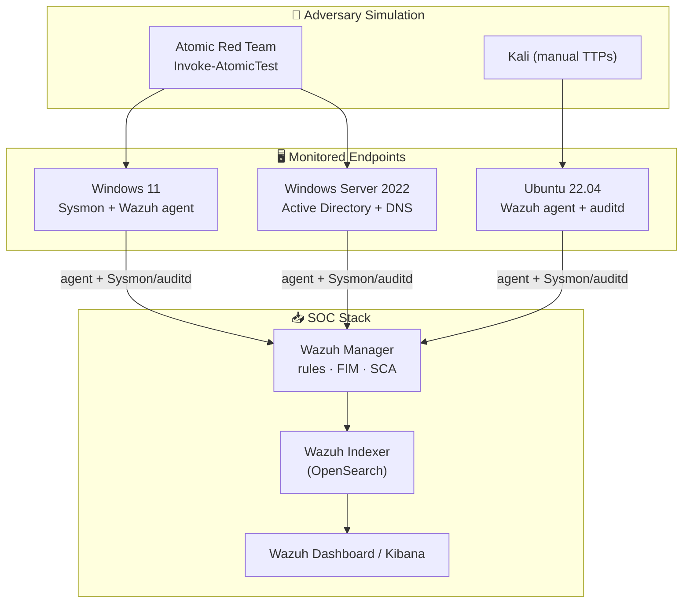

# 🏠 Home SOC Lab

> A virtualized Security Operations Center built to generate real telemetry, simulate adversary behavior, and validate detections end-to-end.

---

## 🎯 Objective

Build a self-contained lab that lets me practice the full defender loop:

> **Simulate an attack → collect the telemetry → detect it → respond → harden → re-test.**

Every other project in this portfolio (detections, hunts, playbooks) was developed and validated against this lab.

## 🧱 Architecture

## 🛠️ Components

| Host | Role | Telemetry Sources |
|------|------|-------------------|
| Windows 11 | Workstation / victim | Sysmon (SwiftOnSecurity config), Security/PowerShell event logs |
| Windows Server 2022 | Domain Controller | AD authentication, DNS, Kerberos events |
| Ubuntu 22.04 | Linux server | auditd, syslog, SSH/auth logs |
| Wazuh Manager | SIEM/EDR core | Rules engine, File Integrity Monitoring, Security Configuration Assessment |
| Kali Linux | Attacker | Manual TTPs, network-based attacks |

## ⚙️ Build Notes

<b>1. Hypervisor & networking</b>

- Hosted on VirtualBox/Proxmox with an **isolated host-only network** (`192.168.56.0/24`) so simulated attacks never leave the lab.
- Snapshots taken before each attack run so the environment can be reset to a known-clean state.

<b>2. Telemetry — making hosts loud</b>

- **Sysmon** deployed with the SwiftOnSecurity base config, tuned to capture process creation (Event ID 1), network connections (3), image loads (7), and registry changes (12-14).
- **PowerShell Script Block Logging** + **Module Logging** enabled via Group Policy.
- **Windows Advanced Audit Policy** enabled for logon, process tracking, and object access.
- **auditd** rules on Linux for execve, identity changes, and sensitive file access.

<b>3. Collection — Wazuh + Indexer</b>

- Wazuh agents enrolled on all endpoints; Sysmon channel forwarded via `localfile` config.
- File Integrity Monitoring (FIM) watching `C:\Windows\System32` and `/etc`.
- Security Configuration Assessment (SCA) running CIS checks automatically.

<b>4. Attack simulation</b>

- **Atomic Red Team** for repeatable, ATT&CK-mapped technique tests (e.g. `T1059.001` PowerShell, `T1003` credential dumping, `T1053` scheduled tasks).
- Manual TTPs from Kali for network-facing attacks (brute force, recon).

## 🔁 The Detection Loop in Practice

1. Run an Atomic test, e.g. `Invoke-AtomicTest T1059.001` (malicious PowerShell).
2. Confirm the telemetry lands in Wazuh/Kibana.
3. Write or tune a detection rule → see [SIEM Detection Rules](../02-siem-detection-rules/).
4. Build/refine the response steps → see [IR Playbooks](../03-incident-response-playbooks/).
5. Apply hardening → see [System Hardening](../05-system-hardening/) → re-run the test to confirm reduced signal.

## 📚 Lessons Learned

- **Default logging is nowhere near enough.** Without Sysmon and script-block logging, most of the interesting Atomic tests were invisible. *Visibility is a prerequisite for detection.*
- **Tuning is the job.** My first custom rules were noisy. Reducing false positives while keeping true positives is where the real skill lives.
- **Mapping to ATT&CK changes how you think** — it turns "I detected a weird process" into "I have coverage for T1059.001, but a gap on T1053."

## ▶️ Reproduce It

The high-level setup steps are documented above. A scripted/automated version of this lab is a planned addition (Vagrant + Ansible) — tracked as a TODO.
