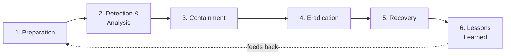

# 🚨 Incident Response Playbooks

> Practical, repeatable response playbooks aligned to the **NIST SP 800-61** incident handling lifecycle. Written to be usable by a tier-1 analyst under pressure.

---

## 🔁 The Lifecycle These Follow

## 📒 Playbooks

| Playbook | Scenario | File |
|----------|----------|------|
| 🎣 Phishing | User reports / clicks a suspicious email | [`phishing.md`](./phishing.md) |
| 🔐 Compromised Account | Anomalous logins, impossible travel, MFA fatigue | [`compromised-account.md`](./compromised-account.md) |
| 🧬 Ransomware | Mass file encryption, ransom note detected | [`ransomware.md`](./ransomware.md) |

## 🧩 What each playbook contains

- **Trigger / detection signals** — how this lands in the queue
- **Severity & escalation criteria** — when to wake someone up
- **Step-by-step actions** mapped to NIST phases
- **Containment decisions** — isolate vs. monitor, and the tradeoffs
- **Evidence to preserve** — for forensics and post-incident review
- **Communication notes** — who to notify

> These are written from a defender's perspective and tested conceptually against scenarios I generated in the [Home SOC Lab](../01-home-soc-lab/).
