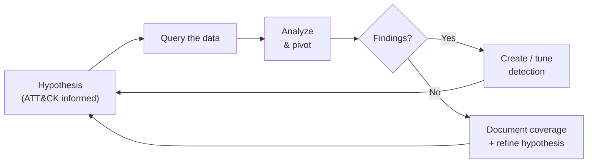

# 🐺 Threat Hunting & Log Analysis

> Hypothesis-driven threat hunts run against telemetry from my [Home SOC Lab](../01-home-soc-lab/). Each hunt follows a structured method and ends with either a detection improvement or a documented "no findings — coverage confirmed."

---

## 🧭 My Hunting Method

I lean on the **Pyramid of Pain** — hunting on *behaviors and TTPs* rather than easily-changed indicators like hashes and IPs.

## 📝 Hunt Writeups

| Hunt | Hypothesis | ATT&CK | Writeup |
|------|-----------|--------|---------|
| Living-off-the-land binaries | Adversaries abuse signed Windows binaries (LOLBins) to evade detection | T1218 | [`hunt-lolbins.md`](./hunt-lolbins.md) |

## 🔎 Query Library

Reusable hunting queries kept in [`queries/`](./queries/):

| File | Platform | Purpose |
|------|----------|---------|
| [`lolbin_execution.kql`](./queries/lolbin_execution.kql) | KQL (Sentinel/Defender) | Surface suspicious LOLBin process activity |
| [`failed_logons.spl`](./queries/failed_logons.spl) | Splunk SPL | Spot password-spray / brute-force patterns |

## 📊 Log Analysis Skills Demonstrated
- Parsing and normalizing noisy Windows Event Logs and Sysmon
- Pivoting from a single suspicious process to parent/child lineage and network connections
- Baselining "normal" to make outliers visible
- Translating findings into durable detections (see [SIEM Detection Rules](../02-siem-detection-rules/))
